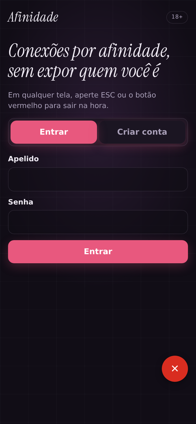
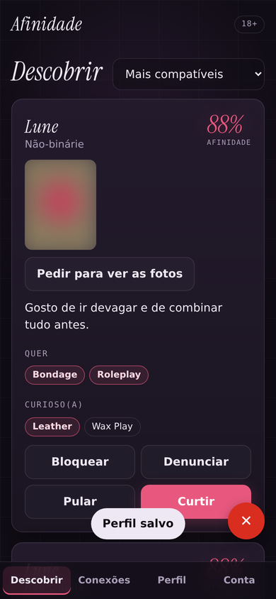
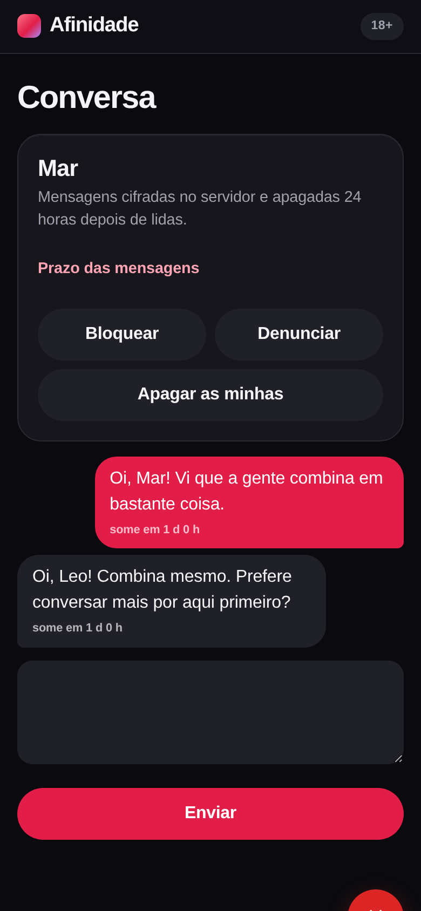

# Afinidade

Rede social adulta (18+) de conexões por afinidade, com foco em diversidade de gênero, fetiches e
**privacidade**. É gratuita para quem usa, anônima entre usuários e roda com custo zero de infraestrutura.

- **Para entender o projeto sem jargão:** [docs/relatorio.md](docs/relatorio.md)
- **Para desenvolver:** [CONTRIBUTING.md](CONTRIBUTING.md) · [docs/arquitetura.md](docs/arquitetura.md)
- **Segurança:** [SECURITY.md](SECURITY.md) · **E-mail + biometria:** [docs/autenticacao.md](docs/autenticacao.md) · **Próximos passos:** [docs/roadmap.md](docs/roadmap.md) · **Plano de execução:** [docs/plano/](docs/plano/parte-01-arquitetura.md) · **Telas:** [docs/telas/](docs/telas/README.md)
- **Linguagem visual "Véu Luminoso":** [docs/design/](docs/design/filosofia-veu-luminoso.md)

<p>
  
  
  
</p>

## O que o app faz

| Funcionalidade | Resumo |
|---|---|
| Conta sem senha | Criada com **e-mail** (código ou link), guardado **criptografado**; depois, **biometria** (digital, rosto ou PIN). Sem telefone nem nome. 18+ e consentimento obrigatórios. |
| Matchmaking | Gênero mútuo → limites absolutos → afinidade ponderada (quero 3 · quero/curioso 2 · curioso 1), calculado no Postgres. |
| Gostos parecidos | Similaridade de preferências (0–100%) para ver quem curte as mesmas coisas. |
| Localização aproximada | Só um quadrado de ~5 km; distância exibida em faixas ("até 10 km"). |
| Fotos protegidas | Metadados/GPS removidos; quem não foi autorizado recebe só uma versão borrada gerada no servidor. |
| Chat efêmero | Só entre conexões; cifrado no banco; cada mensagem some 5 minutos depois de lida. |
| Botão de pânico | Botão vermelho ou tecla ESC: apaga a tela, limpa o navegador, encerra a sessão e abre o Google. |
| Segurança da comunidade | Bloqueio, denúncia (com evidências opcionais), ocultação automática e fila de moderação. |

## Rodando localmente

```bash
cp .env.example .env     # gere JWT_SECRET e CHAVE_MENSAGENS (comando no arquivo)
make instalar            # dependências + pre-commit
make db                  # PostgreSQL local via Docker
make rodar               # http://localhost:8000  (API em /docs)
make verificar           # lint + testes + auditoria, como no CI
```

Com Docker para tudo: `docker compose up --build`.

## Custo zero em produção

| Peça | Serviço gratuito |
|---|---|
| Código, CI/CD e testes diários | GitHub + GitHub Actions |
| API + front-end (um contêiner) | Render, plano *free* (`render.yaml`) |
| Banco PostgreSQL | Neon, plano *free* |
| E-mails de acesso | Resend, plano *free* (ou qualquer SMTP) |

**Deploy:** crie o banco no Neon → no Render, *New → Blueprint* apontando para o repositório (ele gera
`JWT_SECRET` e `CHAVE_MENSAGENS` sozinho; cole o `DATABASE_URL` do Neon, a `RESEND_API_KEY` e o `EMAIL_REMETENTE` do Resend (grátis) e, com a URL do app em mãos, `WEBAUTHN_RP_ID` e `WEBAUTHN_ORIGENS`; veja [autenticacao.md](docs/autenticacao.md)) → no GitHub, em
*Settings → Environments → producao*, cadastre o secret `RENDER_DEPLOY_HOOK_URL` e a variável `APP_URL`.
A partir daí, todo merge na `main` que passa na pipeline vai para o ar sozinho.

Limites dos planos gratuitos mudam; confira antes de lançar. O plano *free* do Render "dorme" sem uso
(o primeiro acesso depois leva alguns segundos).

## Pipeline (GitHub Actions)

`lint` (ruff + JS) · `testes` (Python + PostgreSQL, cobertura mínima 90%) · `navegador` (Playwright) ·
`auditoria` (vulnerabilidades) → `imagem` (build Docker + smoke test) → `deploy` (só na `main`).
Roda em todo push/PR e **todo dia às 06:17** para pegar vulnerabilidades novas. Detalhes em
[`.github/workflows/ci.yml`](.github/workflows/ci.yml).

## Anonimato: limites honestos

O app não guarda telefone, IP, coordenadas, data de nascimento nem metadados de fotos; o e-mail fica
criptografado com chave fora do banco e nunca aparece para ninguém; e tudo é apagado de verdade quando
a conta é excluída. Mesmo assim, **não prometa "100% de anonimato"**: o provedor
de hospedagem vê IPs de conexão, e um apelido ou bio reaproveitado de outra rede pode identificar alguém.
Antes de abrir ao público, revise com advogado(a): LGPD (dados sobre vida sexual são sensíveis),
Marco Civil (art. 15, guarda de registros de acesso) e ECA Digital (verificação de idade).
