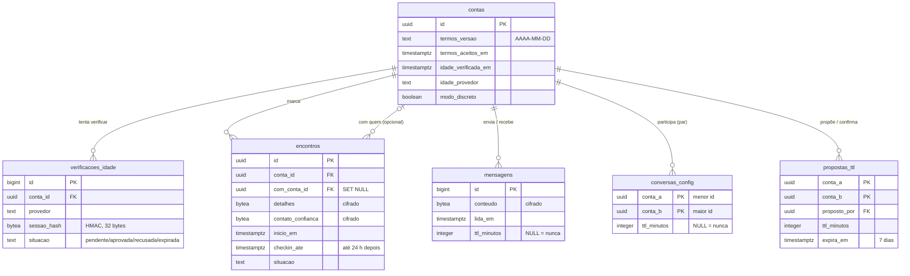

# Plano de execução · Parte 2 — Modelo de dados

A migração `db/migrations/0010_base_das_proximas_partes.sql` cria de uma vez o que as Partes 3, 6,
9 e 10 precisam, para o esquema não ser reaberto a cada parte.

**Regra de ouro:** ela só **acrescenta** colunas e tabelas, com padrões que mantêm o comportamento
atual. A versão anterior do app funciona com o banco novo (rollback seguro, ver
[operacao.md](../operacao.md#deploy-e-como-voltar-atrás)).

## O que entra

| Parte | Onde | Para quê |
|---|---|---|
| 3 · Idade | `contas.idade_verificada_em`, `contas.idade_provedor` | Resultado da verificação: **só** "verificada em tal data, por tal provedor" |
| 3 · Idade | tabela `verificacoes_idade` | Tentativas em andamento; o id da sessão do provedor fica só como HMAC |
| 6 · Mensagens | `mensagens.ttl_minutos` | Prazo gravado em cada mensagem no envio (padrão 5 = comportamento atual) |
| 6 · Mensagens | tabela `conversas_config` | Prazo acordado por conversa |
| 6 · Mensagens | tabela `propostas_ttl` | Uma pessoa propõe um prazo novo, a outra confirma |
| 9 · Encontros | tabela `encontros` | Encontro compartilhado com um contato de confiança, com check-in |
| 10 · Termos | `contas.termos_versao`, `contas.termos_aceitos_em` | Qual versão dos termos foi aceita e quando |
| 10 · Discrição | `contas.modo_discreto` | Preferência do modo discrição |

## Diagrama (tabelas novas e as que mudaram)

## Decisões

**Prazo das mensagens gravado em cada mensagem.** O plano diz que mudar o prazo vale só para
mensagens enviadas **depois** da confirmação. Guardar o prazo na própria mensagem resolve isso sem
histórico de configurações: `expira_em = lida_em + ttl_minutos`; sem leitura, não expira; `NULL`,
nunca expira. Os valores permitidos ficam numa função do banco (`ttl_mensagem_valido`), usada por
todas as tabelas:

| Minutos | Horas | Dias | Semanas | Meses | — |
|---|---|---|---|---|---|
| 5, 15, 30, 60 | 6, 12, 24 | 3, 7, 14 | 4 | 1, 3, 6 | nunca |

(1 semana = 7 dias já está em "dias".)

**Conversa = par ordenado `(menor id, maior id)`.** O mesmo critério do índice de mensagens: a
mesma conversa nunca tem duas configurações, e o banco recusa a ordem invertida.

**Verificação de idade sem dados do documento.** Não existe coluna para CPF, documento, selfie,
imagem ou data de nascimento, e um teste garante que nenhuma seja criada por engano. O provedor
externo faz a verificação; aqui fica só o resultado.

**Encontros cifrados.** Local, observações e o contato de confiança (dado de uma terceira pessoa)
ficam cifrados com AES-256-GCM, chave fora do banco. Em claro, só os horários que a tarefa de
fundo precisa para disparar o alerta. Se a outra pessoa excluir a conta, o registro de segurança
de quem marcou continua (`SET NULL`); se quem marcou excluir, tudo vai junto.

## Garantias testadas (`tests/test_modelo_dados.py`)

- **Exclusão imediata:** toda tabela que aponta para `contas` usa `CASCADE` ou `SET NULL`. Uma
  tabela nova que "prendesse" uma conta excluída faz o teste falhar (verificado).
- Colunas sensíveis novas são `bytea` (cifradas), e não há colunas de documento ou nascimento.
- Os 15 prazos permitidos são aceitos, e valores fora da lista são recusados.
- A mensagem grava o prazo (a Parte 6 passou o padrão do app para 24 h; a coluna mantém 5, o prazo das mensagens antigas).
- Termos e verificação de idade só são gravados completos (versão + data; data + provedor).
- Proposta de prazo só pode vir de quem está na conversa; excluir a conta limpa tudo.
- Encontro: check-in depois do início e até 24 h; não dá para marcar consigo mesma.

## Próximas partes (o que usa este esquema)

1. **Parte 6:** a API passa a gravar `ttl_minutos` a partir de `conversas_config` (padrão novo
   24 h), rotas para propor/confirmar e a tela de escolha do prazo.
2. **Parte 3:** integração com o provedor de idade.
3. **Parte 10:** tela de termos e consentimento, e o modo discrição.
4. **Parte 9:** tela de encontro, check-in e alerta por e-mail.
